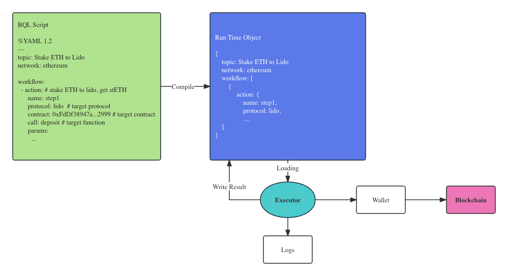

# BQL - Blockchain Quest Language Specification

Author: Anthonyx@port3.io

Date: 2023-07-27

version: v0.0.1

## Simple Summary

Blockchain Quest Language(BQL) is an on-chain interactive scripting language that enables blockchain-based interaction with any on-chain protocol.

## Abstract

Blockchain Quest Language is a language specification based on YAML for describing on-chain interaction processes. BQL scripts can be written, executed, and used for automation and workflow-based interaction on the blockchain. This language is simple and easy to read, and can be used as a new UX method to replace traditional interface-based dApp interactions, enabling access to any on-chain protocol.

## ****Motivation****

In blockchain industry, more and more people want to accelerate and automate their on-chain operations. There are numerous Quest platforms in the Web3 field that guide users to convert to on-chain interactions in actual projects, and various airdrops attract users to execute various on-chain interactions. Complex tutorials have a high threshold, and manual execution of on-chain interactions consumes a lot of time. Embedding all dApp interfaces into web pages is not a very good solution. This article will explore another feasible method, which is to implement a scripting language that can describe the on-chain interaction strategies that users want to execute.

On the blockchain, we hope to accurately define user behavior and translate it into intuitive tags. However, the granularity of interactions on the chain is very detail (for example: an address executing a contract call action), lacking in revealing associations between transactions. If these interaction actions can be defined in BQL scripts, it can form larger granularity user behavior descriptions.

ChatGPT has accelerated the arrival of the AI era. People hope to describe on-chain interaction strategies through their oral expressions. However, pure natural language expressions are not accurate, and actual on-chain interactions require each parameter to be passed correctly, otherwise it will not be executed correctly. BQL is a good way to bridge the gap between AI and on-chain interactions, serving as an intermediate structure to achieve translation between natural language and on-chain interactions.

## Language Define

BQL language is written in YAML structure and uses predefined keywords to describe the interaction process on the chain. We define each interaction on the chain as an Action, and multiple Actions form a Workflow. Action defines in detail how to interact on the chain, and the BQL executor executes step by step according to the script's definition content and obtains feedback results.

An example of a BQL script:

```python
%YAML 1.2
---
topic: Stake ETH to Lido
network: ethereum

workflow:
	- action: # stake ETH to lido, get stETH
			name: step1
			protocol: lido  # target protocol
			contract: 0xFdDf38947aFB03C621C71b06C9C70bce73f12999 # target contract
			call: deposit # target function
			params:
				deposit: 15000000000000
				_depositsCount: 1
				_stakingModuleId: "12345"
				_depositCalldata: ""
			return:  # return values
				- {depositAmount}
```

### Language Structure

BQL language defines hierarchical relationships through indentation structure, which is fully compatible with YAML. These data structures describe the parameters required for various on-chain interactions. We will discuss the BQL language structure in different sections.

### Keywords

BQL defines several keywords that must appear in specific structures, including:

```yaml
# Comments start with #
# Topic: Swap on Uniswap
# Author: anthonyx@port3.io
# Date: 2023-07-19

# Define the program's loop running period, in seconds.
interval: 10  # Run once every 10 seconds

# Define the network on which the program runs.
network: ethereum # e.g. bnb_chain, polygon

# Define a workflow that contains several actions below.
workflow:
	- action:
			name: step1
			...

# Define an action
action:
	name: step1
	sleep: 10 # sleep 10 seconds before run this action
	protocol: lido  # Interactive Object Protocol
	contract: 0xFdDf38947aFB03C621C71b06C9C70bce73f12999 # Interactive target contract address
	call: deposit # Interaction Target Function
	params:
		- deposit: 15000000000000
		- _depositsCount: 1
	return:  # Receiving array as return value
		- {depositAmount} # The return value is stored in the variable depositAmount.

# Specify which protocol to use
protocol: uniswap

# Specify which contract to use.
contract: 0x123...567

# Define the execution condition of an Action
condition: $price > 1000

# Define a sleep
sleep: 10 # sleep for 10 seconds

# Define a list to receive return values
return:
	- {amount}
	- {address}

# Runtime wallet address
$ADDRESS

# Timestamp at runtime
$CURRENT_TIMESTAMP
```

### Variable Definition

In BQL, besides the keywords mentioned above, defining a variable is very simple. You can define a variable by using the format "key: value".

```yaml
a: 100   # Define an integer variable
b: 3.14  # Define a floating point number
c: TRUE  # Define a boolean value
d: 2018-02-17 # Define a date variable
e: null # Define a null value
f: "abc" # Define a string
g: !!str abc # Another way to define string
h: !!float 123 # Specify float type
payAmount: 100 # Define an Int variable
contractAddress: 0xdAC17F958D2ee523a2206206994597C13D831ec7  # Define an address string
```

### Quoted Variables

Variables defined in a program can be referenced anywhere. To use a variable in an expression, simply embed a dollar sign + variable name in the expression:

```yaml
$amount  # Refer to a variable named "amount" in the first level of the execution context.

# Referencing in params
params:
  - $amount + 100 # Referencing variables in an expression
  - $workflow[0].contract # Refer to the contract of first action
```

The executor encounters a symbol starting with "$", which should be interpreted as a variable reference. It searches for the variable in the execution context and returns its value. If the variable is not found, it returns null.

### Receiving Variables

If a value cannot be determined at the time of definition, a placeholder can be used to receive the variable:

```yaml
return:
	- {amount}    # Receive the first return value and assign it to the variable 'amount'.
	- {address}    # Receive the second return value and assign it to the 'address' variable.
```

Received variables can be referenced in later steps using the $ symbol, just like regular variables.

### Operation Expressions

The BQL executor identifies various expressions through regular expression matching and maps them to different operations. The operations can be combined to achieve different calculations.

```yaml
# Plus
params:
	price: $predictPrice + 0.01

# Subtraction
params:
	price: $predictPrice - 0.01

# Multiplication
params:
	price: $predictPrice * 0.01

# Division
params:
	price: $predictPrice / 10

# Operations can be freely combined
params:
	price: 60 * 20 / 10 + 5 # result 125
```

Calculations with variables: first replace the variable values in the references, then perform addition, subtraction, multiplication, or division.

### Expression evaluation

In BQL, to implement the following evaluation and determine if the expression returns True or False, it is commonly used in condition calculations:

```python
a: 11 # define variable $a

# Greater than
$a > 10 # True

# Equal to
$a = 10  # False

# Less than
$a < 10 # False

# Greater than or equal to
$a >= 10 # True

# Less than or equal to
$a <= 10 # False
```

## Execute Model

The writing of BQL scripts can be done on any editor. By following the BQL syntax, a proprietary editor can be created which can perform syntax checks on BQL scripts and simulate execution steps.

BQL scripts require an executor that performs all the above-mentioned functions. During execution, the BQL script is parsed and transformed into a runtime data state. The executor parses and operates on the runtime data state, and writes the return value back to the runtime data state.



Any third-party platform can implement an Executor based on the definition of BQL above to execute self-written BQL scripts.

Since BQL needs to interact with the user's wallet, there are two modes to choose from. One is to execute BQL in the user's frontend environment to ensure the security of the user's wallet. The user's browser can also provide a relatively independent and secure execution environment. The other mode is to host the user's private key and execute the user's operations through a separate sandbox environment. The hosting mode has higher requirements for the security of the user's private key.

## Security and Contract Library

In theory, BQL supports the invocation of any contract method, and its security is equivalent to executing transactions on a website. However, users who do not have the ability to review BQL code and contract code may face risks when executing them. Therefore, it is necessary to collect and review various protocols and contracts before running BQL. The executor should only allow the execution of collected contracts to reduce the risk of users executing unknown contracts. Additionally, collecting contracts can speed up the writing of BQL. By selecting the corresponding protocol and function, the corresponding BQL code can be generated.

Collecting contracts can also provide the ABI of the contract, which can be verified before execution to prevent transaction execution failures. A contract collection platform similar to ChainList can be created to collect all contracts, conduct security risk audits, and create a public contract library for editors and executors to access.

## Integration with SBT

Soulbound Token (SBT) is a non-fungible token that cannot be transferred. It is used to describe a user's identity based on their positive characteristics. However, the current descriptions of various Soulbound metadata are more focused on other information rather than user behavior. As a result, many Quest platforms have distributed a large number of SBT, but since they do not contain user behavior data, they are essentially worthless.

To associate SBT with a particular identity, it is necessary to accurately describe user behavior and require users to perform actions that match the description in order to obtain SBT. BQL, a data tagging language, can be easily converted to JSON format and embedded in SBT's metadata, allowing SBT to describe user behavior.

The issuer of the SBT can grant the token to a user by checking if the user has executed all the required on-chain actions, thus marking the SBT with a corresponding identity.

An Example of SBT Metadata:

```python
{
  "name": "SoQuest Skywalker Pass",
  "symbol": "SoQuest Skywalker Pass",
  "description": "Those who completed a series of moves on the chain were awarded the Skywalker Badge.",
  "issuer": "Port3 Network",
  "image": "https://sograph-static.s3-accelerate.amazonaws.com/dashboard/images/04966BF262CC260B927028AB530EB46E.jpg",
  "attributes": [
    {
      "trait_type": "Background",
      "value": "Brown Planets"
    }
  ],
  // BQL that relate with this SBT
	"BQL": [{
		"topic": "Mint Port3 Avatar",
		"network": "bnb_chain",
		"workflow": [ // action details
			{
				"action": {
					"name": "mint_avatar",
					"protocol": "Port3Avatar",
					"call": "mint",
					"params": {
						"_mintAmount": 1,
						"_to": "0x02472BE0E9ef11Da8C5936081f4239B362dC4fA0",
						"_sinature": "0x82df3e68f8e98ae8aa5bf2c1991289a0fe1e1a23f44e71e1bf2260140da40e656bf5e20b0868790af1598e8ba959dc660c8d759854ed4b737af37350ade5d9581c",
					}
				},
				// more actions
				...
			}
		]
	}, {
	// more workflows
	...
	}]
  "version": 1
}
```

## Scalability

The current design of BQL only covers on-chain operations. BQL can also be easily extended to describe Web2 scenarios by add more keywords.

For example, BQL can be used to describe a user's Twitter Like behavior:

```python
%YAML 1.2
---
topic: Like Port3 Network tweet

workflow:
	- action: # Like tweet
			name: step1
			platform: twitter
			method: like
			params:
				account: $TWITTER_HANDLE # user's twitter account
				tweet_id: 1676859443403956224
			return:
				- {retweet_id}
```

For the implementation phase, the application layer must support platform functionality, such as allowing users to "like" on Twitter. We also need to record information about different platforms and actions, as each platform may have its own definitions.

To enable detection, support from the "Social Data Layer" is necessary. This layer must index Web2 platform behavior and store it in IPFS or open data repositories to enable the evaluation of user behavior.
